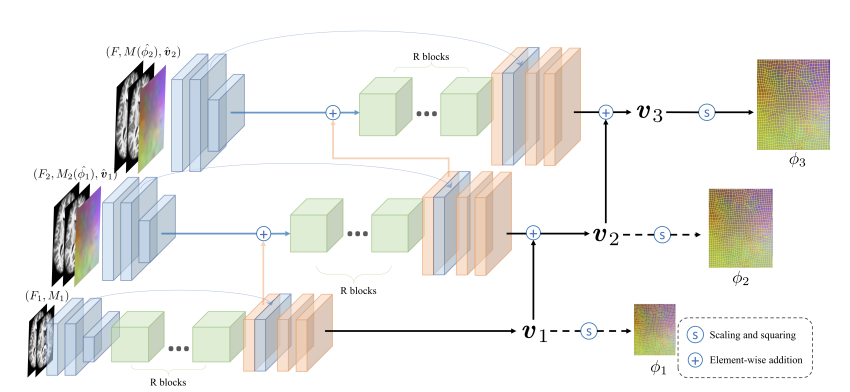

#### Registration for Medical Images
- [Large Deformation Diffeomorphic Image Registration with Laplacian Pyramid Networks](#small_blue_diamond-large-deformation-diffeomorphic-image-registration-with-laplacian-pyramid-networks)    
_Jun 2020, MICCAI_
- [VoxelMorph: A Learning Framework for Deformable Medical Image Registration](#small_blue_diamond-voxelmorph-a-learning-framework-for-deformable-medical-image-registration)    
_Sep 2018, TMI_

## Registration for Medical Images

### :small_blue_diamond: Large Deformation Diffeomorphic Image Registration with Laplacian Pyramid Networks
_Jun 2020, MICCAI_  

[[ArXiv](https://arxiv.org/abs/2006.16148)]
[[GitHub](https://github.com/cwmok/LapIRN)]

#### Main idea
The paper proposes a multi-resolution coarse-to-fine training strategy for deformable image registration.

### :small_blue_diamond: VoxelMorph: A Learning Framework for Deformable Medical Image Registration
_Sep 2018, TMI_  

[[ArXiv](https://arxiv.org/abs/1809.05231)]
[[GitHub](https://github.com/voxelmorph/voxelmorph)]

#### Main idea
The paper proposes a method to train CNN for pairwise medical image registration.

