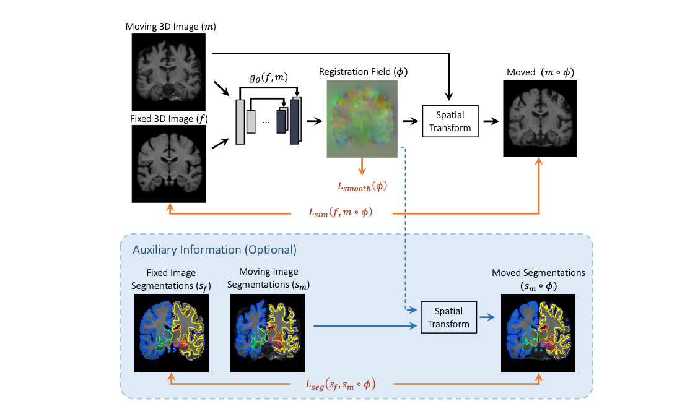

#### Registration for Medical Images
- [VoxelMorph: A Learning Framework for Deformable Medical Image Registration](#small_blue_diamond-voxelmorph-a-learning-framework-for-deformable-medical-image-registration)    
_Jan 2023, TMI_

## Registration for Medical Images

### :small_blue_diamond: VoxelMorph: A Learning Framework for Deformable Medical Image Registration
_Sep 2018, TMI_  

[[ArXiv](https://arxiv.org/abs/1809.05231)]
[[GitHub](https://github.com/voxelmorph/voxelmorph)]

#### Main idea
The paper proposes a method to train CNN for pairwise medical image registration.

