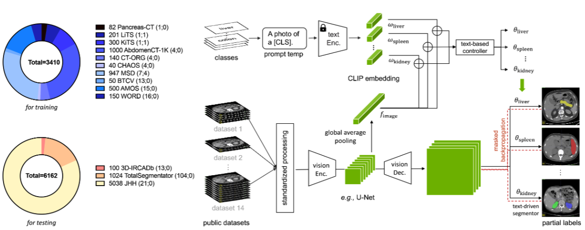

#### Segmentation for Medical Images
- [CLIP-Driven Universal Model for Organ Segmentation and Tumor Detection](#small_blue_diamond-clip-driven-universal-model-for-organ-segmentation-and-tumor-detection)    
_Jan 2023, ArXiv_

## Segmentation for Medical Images

### :small_blue_diamond: CLIP-Driven Universal Model for Organ Segmentation and Tumor Detection
_Jan 2023, ArXiv_  

[[ArXiv](https://arxiv.org/abs/2301.00785)]
[[GitHub](https://github.com/ljwztc/CLIP-Driven-Universal-Model)]

#### Main idea
Universal Model incorporates text embedding to learn parameters of segmentation head and adopts masked back-propagation mechanism with binary segmentation mask.

