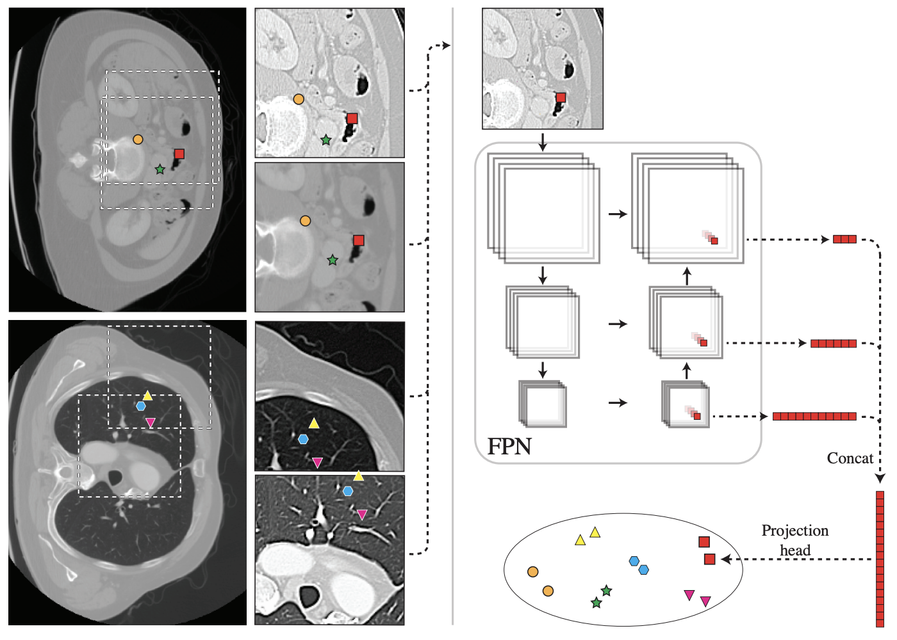
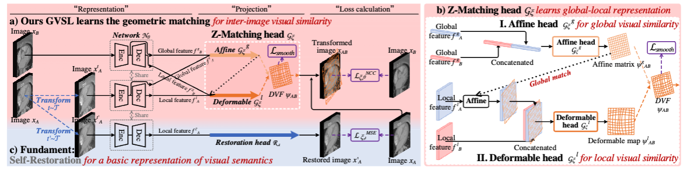
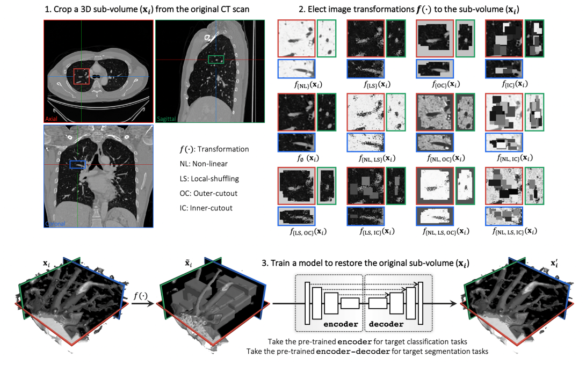

#### Self-Supervised Learning for Medical Images
- [vox2vec: A Framework for Self-supervised Contrastive Learning of Voxel-level Representations in Medical Images](#small_blue_diamond-vox2vec-a-framework-for-self-supervised-contrastive-learning-of-voxel-level-representations-in-medical-images)    
_Jul 2023, MICCAI_
- [Geometric Visual Similarity Learning in 3D Medical Image Self-supervised Pre-training](#small_blue_diamond-geometric-visual-similarity-learning-in-3d-medical-image-self-supervised-pre-training)    
_Mar 2023, CVPR_
- [Self-Supervised Pre-Training of Swin Transformers for 3D Medical Image Analysis](#small_blue_diamond-self-supervised-pre-training-of-swin-transformers-for-3d-medical-image-analysis)    
_Nov 2021, CVPR_
- [Transferable Visual Words: Exploiting the Semantics of Anatomical Patterns for Self-supervised Learning](#small_blue_diamond-transferable-visual-words-exploiting-the-semantics-of-anatomical-patterns-for-self-supervised-learning)    
_Feb 2021, TMI_
- [Models Genesis: Generic Autodidactic Models for 3D Medical Image Analysis](#small_blue_diamond-models-genesis-generic-autodidactic-models-for-3d-medical-image-analysis)    
_Aug 2019, MICCAI_

## Self-Supervised Learning for Medical Images

### :small_blue_diamond: vox2vec: A Framework for Self-supervised Contrastive Learning of Voxel-level Representations in Medical Images
_Jul 2023, MICCAI_  

[[ArXiv](https://arxiv.org/abs/2307.14725)]
[[GitHub](https://github.com/mishgon/vox2vec)]

#### Main idea
Voxel-level representations are obtained via the concatenation of corresponding feature vectors from different levels of the FPN. The representations are projected to the space where contrastive loss is computed.

##

### :small_blue_diamond: Geometric Visual Similarity Learning in 3D Medical Image Self-supervised Pre-training
_Mar 2023, CVPR_  

[[ArXiv](https://arxiv.org/abs/2303.00874)]
[[GitHub](https://github.com/YutingHe-list/GVSL)]

#### Main idea
Affine matrix and deformable map are predicted to align two different images, while normalized cross-corellation loss is used to evaluate alignment between them.

##

### :small_blue_diamond: Self-Supervised Pre-Training of Swin Transformers for 3D Medical Image Analysis
_Nov 2021, CVPR_  

[[ArXiv](https://arxiv.org/abs/2111.14791)]
[[GitHub](https://github.com/Project-MONAI/research-contributions/tree/main/SwinUNETR)]

#### Main idea
3D transformer-based encoder, Swin UNETR, pretrained with a combination of pre-text tasks tailored for 3D medical imaging data: masked volume inpainting, contrastive learning and rotation prediction.

  
  

##

### :small_blue_diamond: Transferable Visual Words: Exploiting the Semantics of Anatomical Patterns for Self-supervised Learning
_Feb 2021, TMI_  

[[ArXiv](https://arxiv.org/abs/2102.10680)]
[[GitHub](https://github.com/fhaghighi/TransVW)]

#### Main idea
Auxiliary classification loss added to masked-based self-supervised pretraining. For classification purpose patches from the same location across different patients assigned with the same pseudo label.

##

### :small_blue_diamond: Models Genesis: Generic Autodidactic Models for 3D Medical Image Analysis
_Aug 2019, MICCAI_  

[[ArXiv](https://arxiv.org/abs/1908.06912)]
[[GitHub](https://github.com/MrGiovanni/ModelsGenesis)]

#### Main idea
Encoder-decoder is pretrained using combination of augmentations: non-linear intensity transformations, local pixel shuffling, out-painting and in-painting  

#### Follow-up works
- Journal paper: [Models Genesis](https://arxiv.org/abs/2004.07882)
- Master thesis: [Pre-trained Models for nnUNet](https://keep.lib.asu.edu/_flysystem/fedora/c7/Bajpai_asu_0010N_20597.pdf)
- Doctoral thesis: [Towards Annotation-Efficient Deep Learning for Computer-Aided Diagnosis](https://keep.lib.asu.edu/_flysystem/fedora/c7/Zhou_asu_0010E_21043.pdf)
