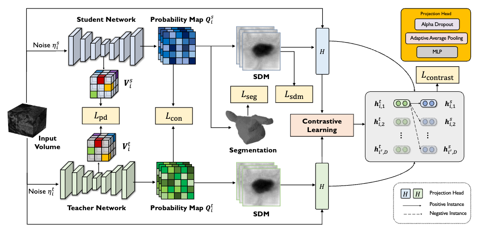

#### Semi-Supervised Learning for Medical Images
- [SimCVD: Simple Contrastive Voxel-Wise Representation Distillation for Semi-Supervised Medical Image Segmentation](#small-blue-diamond-simcvd-simple-contrastive-voxel-wise-representation-distillation-for-semi-supervised-medical-image-segmentation)  
_Aug 2021, TMI_ 

## Semi-Supervised Learning for Medical Images

### :small_blue_diamond: SimCVD: Simple Contrastive Voxel-Wise Representation Distillation for Semi-Supervised Medical Image Segmentation
_Aug 2021, TMI_  

[[ArXiv](https://arxiv.org/abs/2108.06227)]

#### Main idea
3D Signed Distance Map (SDM) predicted for two views of the same volume. In order to fuse geometric and intensity information, SDMs added to the input volume. Projection head encodes each 2D slice of two resulted volumes to the feature vector. InfoNCE loss applied on these feature vectors.

##
