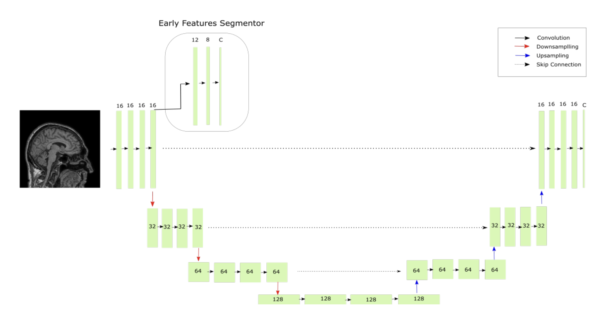

## Unsupervised Domain Adaptation

### :small_blue_diamond: Unsupervised Domain Adaptation through Shape Modeling for Medical Image Segmentation
_Jul 2022, MIDL_  

[[ArXiv](https://arxiv.org/abs/2207.02529)]
[[GitHub](https://github.com/yyNoBug/VAE_segmentation)]

#### Main idea
At first step the VAE network is trained on the source domain with the objective to reconstruct the ground truth masks. At second step the fixed VAE network is used as a regularizer for masks (shapes) produced during training of the target domain segmentation model.

##

### :small_blue_diamond: Unsupervised Domain Adaptation for Medical Image Segmentation via Self-Training of Early Features
_Dec 2021, MIDL_  

[[OpenReview](https://openreview.net/forum?id=wc9qnxw35tS)]
[[GitHub](https://github.com/ferasha/UDAS)]

#### Main idea
Only early layers of model pretrained on labeled source domain data adapted to target domain data. This is achieved by adding a segmentation
head for early features, and using the final predictions of the network as pseudo-labels for refinement.

##

### :small_blue_diamond: Structure-Driven Unsupervised Domain Adaptation for Cross-Modality Cardiac Segmentation
_Dec 2021, TMI_  

[[IEEEXplore](https://ieeexplore.ieee.org/document/9463875)]

#### Main idea
At first step the landmark detection module is trained to extract the anatomical cardiac structure represented by a set of 3D landmarks. At second step the segmentation module is trained with domain-agnostic inputs: an extracted set of points and a set of edges from the canny operator.

##

### :small_blue_diamond: Unsupervised Domain Adaptation via Disentangled Representations: Application to Cross-Modality Liver Segmentation
_Jul 2019, MICCAI_  

[[ArXiv](https://arxiv.org/abs/1907.13590)]

#### Main idea
At first step the framework is trained to decompose a latent image reperesentation into a domain-invariant content space, which preserves the anatomical information, and a domain-specific style space, which represents the modality information. At second step the segmentation model is trained with content-only images.

##

### :small_blue_diamond: Unsupervised Domain Adaptation for Medical Imaging Segmentation with Self-Ensembling
_Nov 2018, NeuroImage_  

[[ArXiv](https://arxiv.org/abs/1811.06042)]
[[GitHub](https://github.com/neuropoly/domainadaptation)]

#### Main idea
Mean teacher framework is applied to multi-site domain adaptation for medical image segmentation.

